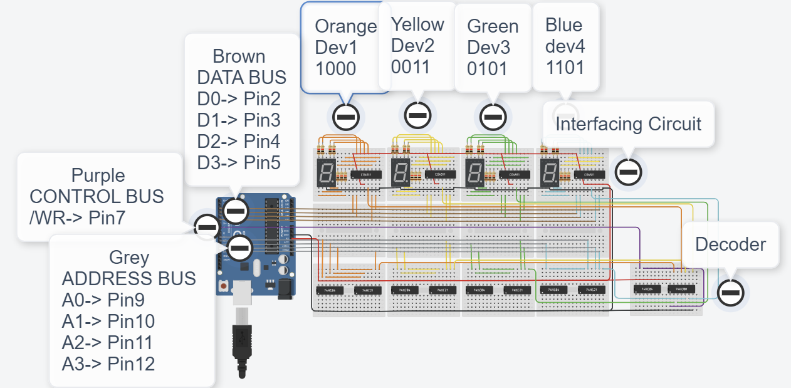

Arduino Computer Memory Simulation
This project simulates computer memory using an Arduino circuit. You can view the project directly in TinkerCAD by following this link. 

[TinkerCAD Project](https://www.tinkercad.com/things/it4dJ2Gi3cc-mighty-robo/editel?returnTo=%2Fthings%2Fit4dJ2Gi3cc-mighty-robo)

The code for the project is located in menmory.cpp. Check the TinkerCAD link above for more details on the circuit design and functionality.

